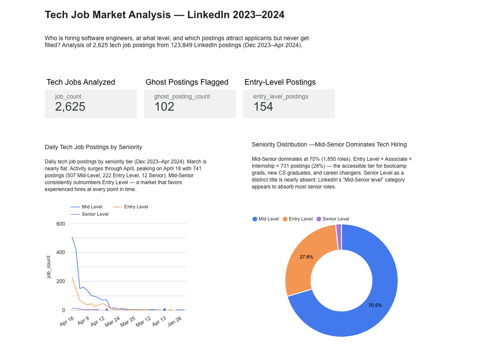
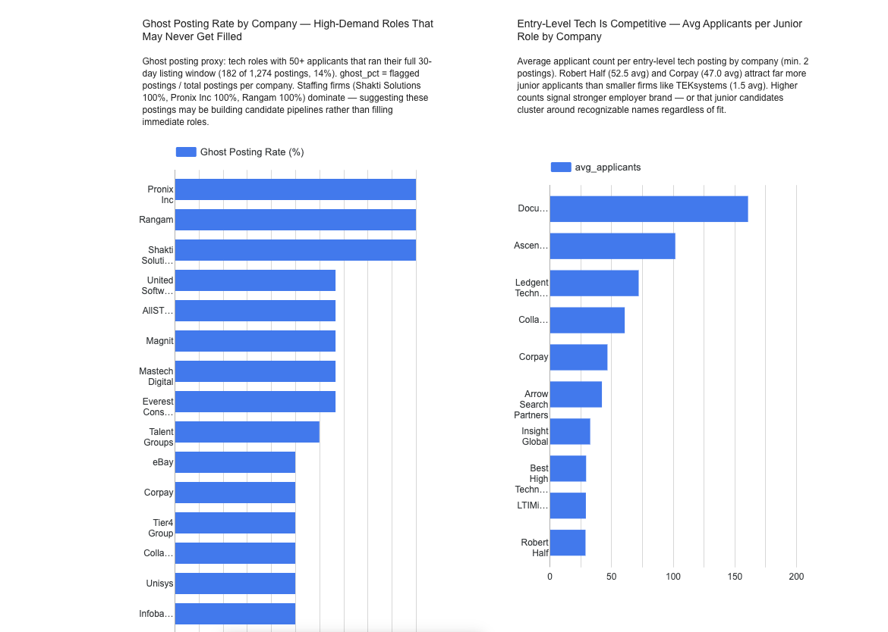

# Tech Job Market Analysis Pipeline
> An end-to-end batch data pipeline analyzing **2,625 tech job postings** from LinkedIn (Jan–Apr 2024) to answer: *Is the tech job market accessible to people trying to break in?*

## Problem Statement

Millions of people try to break into tech every year — bootcamp graduates, new CS grads, and career changers. But how accessible is the market really? This project builds a complete data engineering pipeline to find out.

**Key findings from the data:**
- **70.5%** of tech postings target Mid-Senior candidates. Only **27.8%** target Entry Level, Associate, or Internship — the accessible tier for people breaking in
- Even during the April 18 hiring surge (741 jobs in one day), the 2:1 Mid-to-Entry ratio held — surges don't proportionally benefit junior candidates
- Entry-level competition is concentrated: Robert Half averages 52.5 applicants per junior role vs TEKsystems at 1.5
- Ghost posting patterns exist: staffing firms (Shakti Solutions, Pronix Inc) show 100% ghost rates — high-demand roles that consistently run to expiry without being filled

**Research questions:**
1. Is the tech job market experience-heavy? What share of postings actually target junior candidates?
2. Where is entry-level competition most fierce — which companies attract the most junior applicants?
3. Which companies show ghost posting patterns — high-demand roles posted but likely never filled?

---

## Dashboard

[**View Live Dashboard →**](https://datastudio.google.com/s/l8MpxNAaI98)





| Tile | Chart Type | Data Source | Insight |
|------|-----------|-------------|---------|
| Daily Postings by Seniority | Line chart *(temporal)* | `mart_seniority_trends` | 2:1 Mid-to-Entry ratio holds even during the April 18 surge (741 jobs) |
| Seniority Distribution | Donut chart *(categorical)* | `mart_seniority_trends` | 70.5% Mid-Level, 27.8% Entry Level, 1.7% Senior |
| Ghost Posting Rate by Company | Horizontal bar | `mart_ghost_postings` | Staffing firms dominate — pipeline building, not real hiring |
| Entry-Level Competition | Horizontal bar | `mart_experience_inflation` | Brand recognition drives junior applicant volume |

---

## Architecture

```
Kaggle Datasets (LinkedIn + Stack Overflow)
        │
        ▼
  Kestra (Docker Compose) — 4-flow batch pipeline
        │
        ├──► Google Cloud Storage ─── Data Lake
        │    gs://fe-jobs-lake-dw/raw/
        │    ├── linkedin_2023_2024/postings.csv
        │    ├── linkedin_2023_2024/job_skills.csv
        │    └── stackoverflow_survey/survey_*.csv
        │
        ├──► BigQuery (raw layer) ─── frontend_jobs dataset
        │    ├── raw_linkedin_job_postings  (123,849 rows, flat)
        │    ├── raw_job_skills
        │    └── raw_stackoverflow_survey
        │
        └──► dbt Core (7 models)
                 ├── staging/       (views)
                 ├── intermediate/  (view)
                 └── marts/         (partitioned + clustered tables)
                          │
                          ▼
                   Looker Studio Dashboard (4 tiles)
```

---

## Technologies

| Layer | Tool | Purpose |
|-------|------|---------|
| Infrastructure as Code | **Terraform** | Provisions GCS bucket + BigQuery dataset on GCP |
| Cloud | **GCP** — GCS + BigQuery | Data lake + data warehouse |
| Orchestration | **Kestra** (Docker Compose) | 4-flow batch pipeline, runs locally |
| Transformation | **dbt Core** | 7 models: staging → intermediate → marts |
| Dashboard | **Looker Studio** | Connected to BigQuery mart tables |

---

## Data Sources

| Dataset | Source | Size | Used For |
|---------|--------|------|----------|
| LinkedIn Job Postings | [Kaggle](https://www.kaggle.com/datasets/arshkon/linkedin-job-postings) | 123,849 postings | Core analysis — 2,625 tech roles extracted |
| Stack Overflow Survey 2022–2024 | [survey.stackoverflow.co](https://survey.stackoverflow.co) | ~90K respondents/year | Developer sentiment context |

---

## Cloud & Infrastructure (IaC)

All GCP resources are provisioned using **Terraform** — no manual console setup required.

```bash
cd terraform && terraform apply
# Creates:
#   - GCS bucket:        fe-jobs-lake-dw        (data lake)
#   - BigQuery dataset:  frontend_jobs           (data warehouse)
```

GCP services: **Google Cloud Storage** (raw CSV storage) and **BigQuery** (analytics warehouse).

---

## Data Ingestion (Batch)

Orchestrated with **Kestra** running locally via Docker Compose. 4 flows run sequentially — each downloads raw data, uploads to GCS, and loads BigQuery:

| Flow | Dataset | What it does |
|------|---------|-------------|
| `01_setup_gcp_kv` | — | Populates KV store with project ID, bucket, dataset config |
| `02_ingest_linkedin_2024` | 123,849 LinkedIn postings | Kaggle download → GCS → BigQuery raw table |
| `03_ingest_linkedin_supplementary` | Job skills + industries | Kaggle download → GCS → BigQuery external tables |
| `04_ingest_stackoverflow_survey` | SO Survey 2022–2024 | curl download → extract CSV → GCS → BigQuery external table |

All tasks use `CREATE OR REPLACE` — fully idempotent and safe to re-run.

---

## Data Warehouse

Raw tables are **flat** (no partition or cluster) for fast ingest — the Bronze layer in the Medallion Architecture. Partitioning and clustering live in the **dbt mart layer** where query patterns are known.

| Mart | Partitioned By | Clustered By | Reason |
|------|---------------|-------------|--------|
| `mart_seniority_trends` | `posted_date` | `seniority_category`, `data_source` | Looker line chart filters by date range; every query groups by seniority |
| `mart_ghost_postings` | — | `company_name` | Company-level aggregation — no meaningful date column per row; bar chart sorts by company |
| `mart_experience_inflation` | — | `company_name` | Company-level aggregation — same reasoning; bar chart sorts by company |

> **Why no partition on the two aggregated marts?** `mart_ghost_postings` and `mart_experience_inflation` aggregate to one row per company — there is no row-level date field to partition on. Applying a partition to a company-level summary table would be meaningless. `mart_seniority_trends` contains row-level date data (`posted_date`) so partitioning is both applicable and beneficial — Looker date filters scan only the relevant partition instead of the full table.

---

## Transformations (dbt)

7 models across 3 layers:

```
models/
├── staging/             ← materialized as views
│   ├── sources.yml
│   ├── stg_linkedin_jobs.sql          clean postings, flag tech roles, normalize seniority
│   ├── stg_job_skills.sql             clean skills lookup
│   └── stg_stackoverflow_survey.sql   extract AI adoption columns
├── intermediate/        ← materialized as view
│   └── int_jobs_unified.sql           join postings + skills, calculate days_listed
└── marts/               ← materialized as tables (partitioned + clustered)
    ├── mart_seniority_trends.sql      daily job counts by seniority — Q1
    ├── mart_ghost_postings.sql        ghost posting rates by company — Q3
    └── mart_experience_inflation.sql  entry-level competition by company — Q2
```

**Key logic:**
- `is_tech_role` flag: 60+ title keyword patterns covering software, web, mobile, data, and DevOps roles — with exclusions for non-software engineering titles
- Seniority normalization: exact match on confirmed LinkedIn values (`'Entry level'`, `'Mid-Senior level'`, `'Associate'`, `'Director'`, `'Executive'`, `'Internship'`)
- Ghost posting proxy: roles with 50+ applicants that ran their full 30-day LinkedIn listing window (182 of 1,274 eligible postings flagged = 14%)

---

## How to Reproduce

### Prerequisites

- GCP account with billing enabled
- [Terraform](https://developer.hashicorp.com/terraform/install) installed
- [Docker Desktop](https://www.docker.com/products/docker-desktop/) running
- Python 3.12:
  ```bash
  brew install pyenv && pyenv install 3.12 && pyenv global 3.12
  ```
- [Kaggle account](https://www.kaggle.com) + API token (kaggle.com/settings → API Tokens)

### Step 1 — Clone the repo

```bash
git clone https://github.com/dwhite02/data-pipeline-tech-jobs
cd data-pipeline-tech-jobs
```

### Step 2 — Provision GCP infrastructure

```bash
mkdir -p ~/.gcp
mv ~/Downloads/your-key.json ~/.gcp/fe-jobs-sa.json

cd terraform
cp terraform.tfvars.example terraform.tfvars
# Edit terraform.tfvars — set your project_id and bucket_name

terraform init && terraform apply
```

### Step 3 — Configure and start Kestra

```bash
cd ../kestra

# Add base64-encoded secrets
echo "SECRET_GCP_CREDS=$(cat ~/.gcp/fe-jobs-sa.json | base64 -b 0)" >> .env_encoded
echo "SECRET_KAGGLE_API_TOKEN=$(echo -n 'your_kaggle_token' | base64)" >> .env_encoded

docker compose up -d
# Open localhost:8080 — login: admin@kestra.io / Admin1234!
```

### Step 4 — Run ingestion flows

In Kestra UI → Flows → paste each YAML → Execute in order:
```
01_setup_gcp_kv → 02_ingest_linkedin_2024 → 03_ingest_linkedin_supplementary → 04_ingest_stackoverflow_survey
```

### Step 5 — Run dbt transformations

```bash
pip3 install "dbt-core>=1.9,<2.0" "dbt-bigquery>=1.9,<2.0"

cp dbt/frontend_jobs_dbt/profiles.example.yml ~/.dbt/profiles.yml
# Edit ~/.dbt/profiles.yml — set project, dataset, keyfile path, location: us-central1

cd dbt/frontend_jobs_dbt
dbt debug   # verify connection
dbt run     # builds all 7 models
```

### Step 6 — View the dashboard

Open the [live dashboard](https://datastudio.google.com/s/l8MpxNAaI98) or rebuild in Looker Studio:
1. Create → Report → Add data → BigQuery → `frontend_jobs` dataset
2. Connect `mart_seniority_trends`, `mart_ghost_postings`, `mart_experience_inflation`
3. Build 4 tiles per the dashboard configuration in the table above

### Credentials

Never committed. `.gitignore` blocks `*.json`, `.env`, `terraform.tfvars`.
Templates provided: `terraform/terraform.tfvars.example` and `dbt/frontend_jobs_dbt/profiles.example.yml`